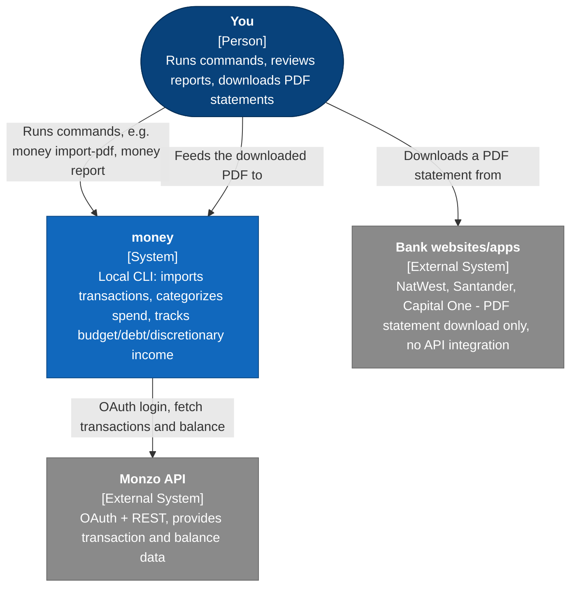
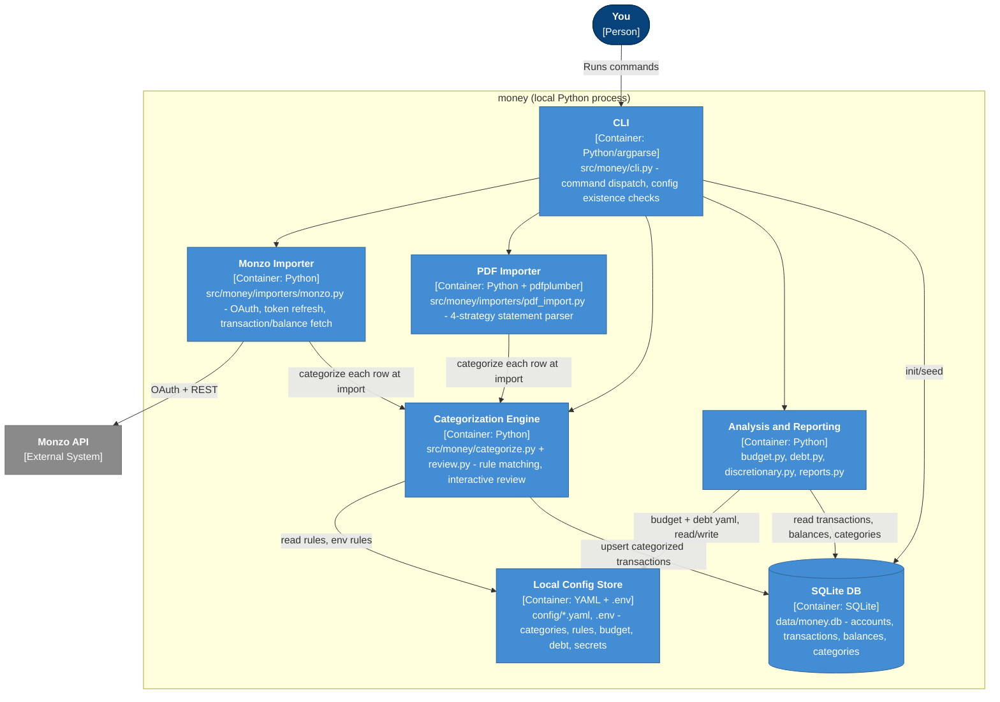
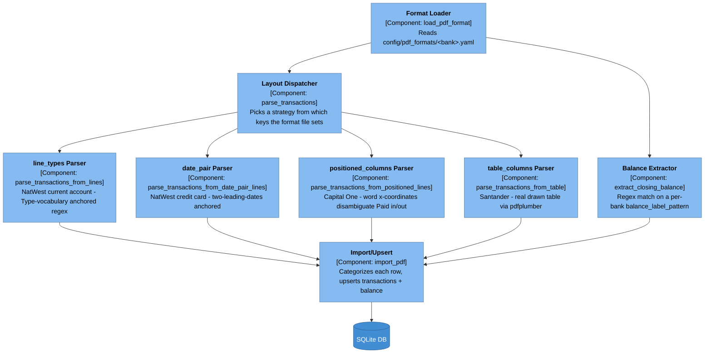
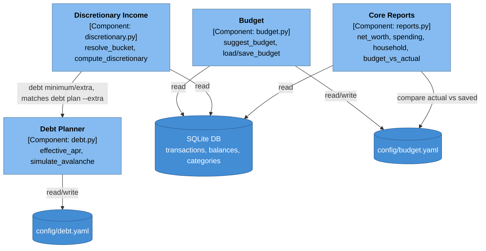
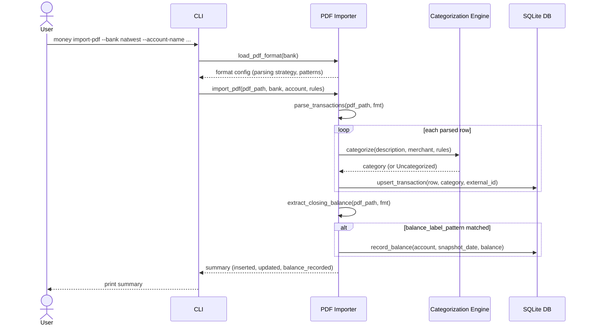
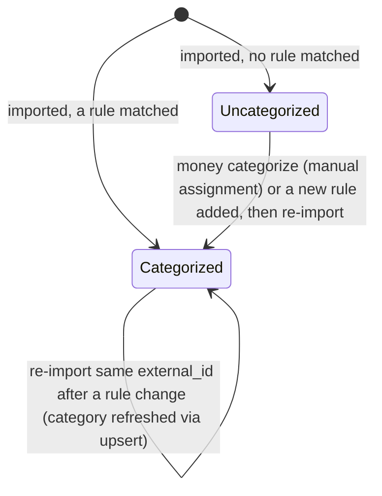

# Architecture

C4-model diagrams for `money`, grounded in the current codebase and
`tickets/` (see `findings.md` and `adr.md` for the evidence and decisions
behind these). All diagrams are Mermaid `flowchart`/`sequenceDiagram`/
`stateDiagram-v2` blocks (not native Mermaid C4 types — see
`.claude/skills/architecture/SKILL.md` for why), rendered and visually
checked (no overlapping labels, no arrows through box interiors) before
this file was considered finished.

## Context

One person, running a local CLI on their own machine. The only outbound
network call this system makes itself is to Monzo's API; every other bank
is integrated by the user manually downloading a PDF statement and
feeding it in.

## Container

Inside the `money` process: an argparse CLI dispatching to two importers
(source-specific), a shared categorization engine (source-agnostic), and
an analysis/reporting layer, all reading and writing one local SQLite
file and a set of local YAML/`.env` config files.

## Component: PDF Importer

The most structurally complex container — one dispatcher over four
genuinely different parsing strategies, since four real bank exports
needed four different approaches (see `tickets/0003-pdf-statement-import.md`,
`architecture/findings.md`).

## Component: Analysis and Reporting

Four independent read paths over the same DB and category tree, one
config file each for the two that carry saved targets (budget, debt).

## Sequence: `money import-pdf`

The cross-container flow for a single PDF import, from CLI invocation to
both tables being written.

## State: transaction categorization lifecycle

The only entity in this system with a real lifecycle worth diagramming —
a transaction moves between two categorization states, and can be
re-categorized on a later re-import if rules changed in between.

